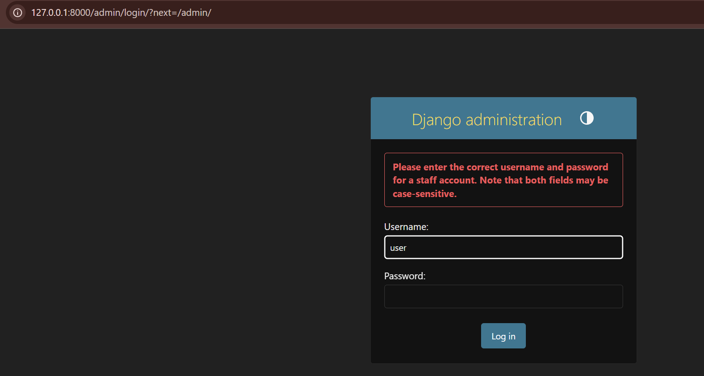
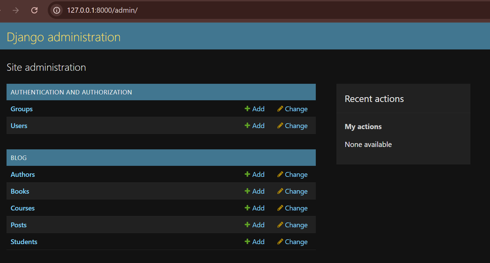

**Django Admin**

Models were registered in `blog/admin.py` with customizations (`list_display`, `search_fields`, `list_filter`, and `inlines`).

After creating a superuser and registering the models, the admin panel is now fully functional.

### Admin Panel Results

**Creating User**
!Creating User](Screenshot0.png)

**Admin Login Page (`http://127.0.0.1:8000/admin/`)**
it shows error if user's information is not correct and allows to log in if everything is correct

**Main Admin Dashboard (Successful Login)**

