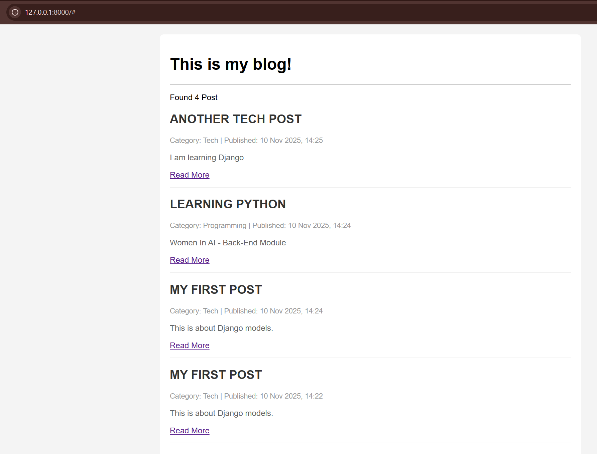

# Django Templates and Views

This task involved creating a dynamic web page to display all blog posts from the database. This required configuring views, URLs and HTML templates to fetch and render data.

## Template Configuration (`settings.py`)

First, the main `templates` directory was registered in the project's `settings.py` file.

## View and URL Setup

A view (`post_list_view`) was created to fetch the data, and URLs were configured to route to it.

### `blog/views.py`

This view fetches all `Post` objects and passes them to the `post_list.html` template.

```python
from django.shortcuts import render
from .models import Post

def post_list_view(request):
    # Fetch all posts, ordered by the newest first
    posts = Post.objects.all().order_by('-created_at')
    
    context = {
        'posts': posts,
    }
    
    return render(request, 'post_list.html', context)
```

### URL Configuration

**`PythonTasksDjango/urls.py` (Project URLs)**
The project's main `urls.py` was updated to include the `blog` app's URLs at the root path (`''`).

```python
# In PythonTasksDjango/urls.py
from django.contrib import admin
from django.urls import path, include 

urlpatterns = [
    path('admin/', admin.site.urls),
    path('', include('blog.urls')),
]
```

**`blog/urls.py` (App URLs)**
A new `urls.py` was created inside the `blog` app to map the view.

```python
# In blog/urls.py
from django.urls import path
from . import views

urlpatterns = [
    # Maps the root URL ('') to the post_list_view
    path('', views.post_list_view, name='post-list'),
]
```

##HTML Templates

Template inheritance was used for a clean structure.

### `templates/base.html` (Parent Template)

This file contains the base structure and styles, with a `` placeholder.

```html
<!DOCTYPE html>
<html lang="en">
<head>
    <meta charset="UTF-8">
    <title>My Blog</title>
    <style>
        body { font-family: sans-serif; margin: 0; background-color: #f4f4f4; }
        .container { max-width: 800px; margin: 20px auto; padding: 20px; background-color: #fff; border-radius: 8px; }
        .post { border-bottom: 1px solid #eee; padding-bottom: 15px; margin-bottom: 15px; }
        .post h2 { color: #333; }
        .post p { color: #666; }
        .meta { font-size: 0.9em; color: #999; }
    </style>
</head>
<body>
    <div class="container">
        <h1>This is my blog!</h1>
        <hr>

        
        

    </div>
</body>
</html>
```

### `templates/post_list.html` (Child Template)

This template extends `base.html` and uses template tags (``, ``) and filters (`|upper`, `|date`, `|truncatewords`) to render the list of posts.

```html




    
        <p>Found {{ posts.count }} Post</p>

        
            <div class="post">
                
                <h2>{{ post.title | upper }}</h2>
                
                <div class="meta">
                    <span>Category: {{ post.category }}</span> |
                    
                    <span>Published: {{ post.created_at | date:"d M Y, H:i" }}</span>
                </div>
                
                <p>{{ post.content | truncatewords:30 }}</p>
                
                <a href="#">Read More</a>
            </div>
        

    
        <p>Sorry, Post Can Not Find </p>
    


```

## Final Result

The code successfully renders all posts from the database onto the main page, applying all specified template tags and filters.


