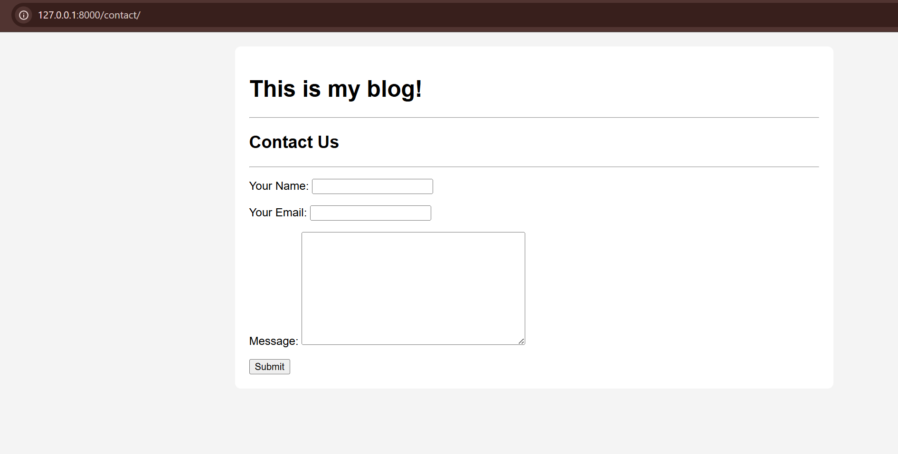
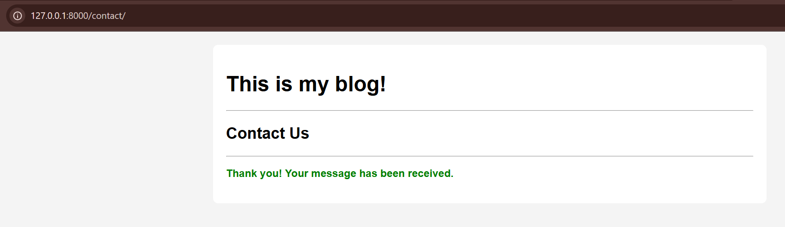

# Assignment 5: Django Forms

This task involved creating a simple contact form, validating user input, and handling form submission using Django's built-in `forms` module.

## Form Definition (`blog/forms.py`)

A new `forms.py` file was created to define the `ContactForm`. `CharField` and `EmailField` provide automatic server-side validation.

```python
from django import forms

class ContactForm(forms.Form):
    name = forms.CharField(label="Your Name", max_length=100)
    email = forms.EmailField(label="Your Email")
    message = forms.CharField(label="Message", widget=forms.Textarea)
```

## View Logic (`blog/views.py`)

A new view, `contact_view`, was added to handle both `GET` (displaying the form) and `POST` (processing the form) requests.

```python
from .forms import ContactForm
from django.shortcuts import redirect 

def contact_view(request):
    if request.method == 'POST':
        form = ContactForm(request.POST)
        
        if form.is_valid():
            name = form.cleaned_data['name']
            email = form.cleaned_data['email']
            print(f"FORM SUBMISSION: Name={name}, Email={email}")
            
            return render(request, 'contact_form.html', {'success': True})

    else:
        form = ContactForm()

    context = {
        'form': form,
    }
    return render(request, 'contact_form.html', context)
```

## Template (`templates/contact_form.html`)

A new template was created to render the form. It extends `base.html` and includes logic to show a success message after validation.

```html


    <h2>Contact Us</h2>
    <hr>
    
    
        <p style="color: green; font-weight: bold;">
            Thank you! Your message has been received.
        </p>
    
        
        <form method="POST">
            
            
            {{ form.as_p }}
            
            <button type="submit">Submit</button>
        </form>
        
    


```

## 4. URL Configuration (`blog/urls.py`)

The `blog` app's `urls.py` file was updated to include a new path for the contact page.

```python
from django.urls import path
from .views import post_list_view, contact_view

urlpatterns = [
    path('', post_list_view, name='post-list'),
    path('contact/', contact_view, name='contact'),
]
```

## Final Result

The form is now accessible at `http://127.0.0.1:8000/contact/`. It successfully validates user input and displays a success message upon completion


