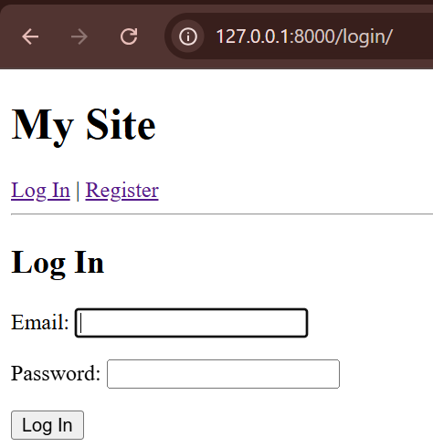
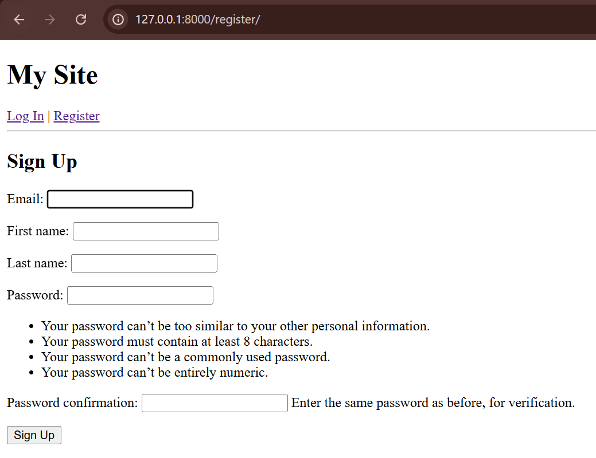

# Custom User and Authentication

This task involved creating a new Django project to implement a custom user model (using email as the identifier) and building the complete authentication flow: registration, login and logout.

## Project Configuration (`PythonTasksDjango2/settings.py`)

The `users` app was added to `INSTALLED_APPS`, and the `AUTH_USER_MODEL` was set to our new custom model *before* the first migration. The `TEMPLATES` directory was also configured.

```python
INSTALLED_APPS = [
    'django.contrib.admin',
    'django.contrib.auth',
    'django.contrib.contenttypes',
    'django.contrib.sessions',
    'django.contrib.messages',
    'django.contrib.staticfiles',
    'users', # Added our new app
]

TEMPLATES = [
    {
        'BACKEND': 'django.template.backends.django.DjangoTemplates',
        'DIRS': [BASE_DIR / 'templates'],
        'APP_DIRS': True,
        'OPTIONS': {
            'context_processors': [
                'django.template.context_processors.request',
                'django.contrib.auth.context_processors.auth',
                'django.contrib.messages.context_processors.messages',
            ],
        },
    },
]
AUTH_USER_MODEL = 'users.CustomUser'
```

## Custom User Model (`users/models.py`)

A `CustomUserManager` was created to handle user creation with email. The `CustomUser` model inherits from `AbstractBaseUser` and sets `USERNAME_FIELD = 'email'`.

```python
from django.contrib.auth.models import AbstractBaseUser, BaseUserManager, PermissionsMixin
from django.db import models
from django.utils import timezone

class CustomUserManager(BaseUserManager):
    def create_user(self, email, password=None, **extra_fields):
        if not email:
            raise ValueError('The Email field must be set')
        email = self.normalize_email(email)
        user = self.model(email=email, **extra_fields)
        user.set_password(password)
        user.save(using=self._db)
        return user

    def create_superuser(self, email, password=None, **extra_fields):
        extra_fields.setdefault('is_staff', True)
        extra_fields.setdefault('is_superuser', True)

        if extra_fields.get('is_staff') is not True:
            raise ValueError('Superuser must have is_staff=True.')
        if extra_fields.get('is_superuser') is not True:
            raise ValueError('Superuser must have is_superuser=True.')

        return self.create_user(email, password, **extra_fields)


class CustomUser(AbstractBaseUser, PermissionsMixin):
    email = models.EmailField(unique=True)
    first_name = models.CharField(max_length=150)
    last_name = models.CharField(max_length=150)
    
    is_staff = models.BooleanField(default=False)
    is_active = models.BooleanField(default=True)
    date_joined = models.DateTimeField(default=timezone.now)

    objects = CustomUserManager()

    USERNAME_FIELD = 'email'
    REQUIRED_FIELDS = ['first_name', 'last_name']

    def __str__(self):
        return self.email
```

## Registration Form (`users/forms.py`)

A custom `UserCreationForm` was created to match the fields of our new `CustomUser` model.

```python
from django import forms
from django.contrib.auth.forms import UserCreationForm
from .models import CustomUser

class CustomUserCreationForm(UserCreationForm):
    class Meta(UserCreationForm.Meta):
        model = CustomUser
        fields = ('email', 'first_name', 'last_name')
```

## 4. Views (`users/views.py`)

Views were created to handle user registration, login, logout and a simple home page.

```python
from django.shortcuts import render, redirect
from django.contrib.auth import login, logout, authenticate
from django.contrib.auth.forms import AuthenticationForm
from .forms import CustomUserCreationForm

def register_view(request):
    if request.method == 'POST':
        form = CustomUserCreationForm(request.POST)
        if form.is_valid():
            user = form.save()
            login(request, user)
            return redirect('home')
    else:
        form = CustomUserCreationForm()
    return render(request, 'register.html', {'form': form})

def login_view(request):
    if request.method == 'POST':
        form = AuthenticationForm(request, data=request.POST)
        if form.is_valid():
            email = form.cleaned_data.get('username')
            password = form.cleaned_data.get('password')
            user = authenticate(request, email=email, password=password)
            if user is not None:
                login(request, user)
                return redirect('home')
    else:
        form = AuthenticationForm()
    return render(request, 'login.html', {'form': form})

def logout_view(request):
    logout(request)
    return redirect('home')

def home_view(request):
    return render(request, 'home.html')
```

## URL Configuration

The project's main `urls.py` was linked to the `users` app's new `urls.py` file.

**`PythonTasksDjango2/urls.py` (Main Project)**
```python
from django.contrib import admin
from django.urls import path, include

urlpatterns = [
    path('admin/', admin.site.urls),
    path('', include('users.urls')),
]
```

**`users/urls.py` (App)**
```python
from django.urls import path
from . import views

urlpatterns = [
    path('', views.home_view, name='home'),
    path('register/', views.register_view, name='register'),
    path('login/', views.login_view, name='login'),
    path('logout/', views.logout_view, name='logout'),
]
```

## Templates

Four templates were created to build the user interface. It is only HTML, without any style and use CSS.

**`templates/base.html`**
```html
<!DOCTYPE html>
<html lang="en">
<head><title>Auth Test</title></head>
<body>
    <h1>My Site</h1>
    
        <p>Welcome, {{ user.first_name }}! ({{ user.email }})</p>
        <a href="">Log Out</a>
    
        <a href="">Log In</a> | 
        <a href="">Register</a>
    
    <hr>
    
</body>
</html>
```

**`templates/register.html`**
```html


  <h2>Sign Up</h2>
  <form method="post">
    
    {{ form.as_p }}
    <button type="submit">Sign Up</button>
  </form>

```

**`templates/login.html`**
```html


  <h2>Log In</h2>
  <form method="post">
    
    {{ form.as_p }}
    <button type="submit">Log In</button>
  </form>

```

**`templates/home.html`**
```html


  <h2>Homepage</h2>
  <p>You are successfully logged in.</p>

```

## Final Result

The authentication system is fully functional. Users can register, log in (using their email) and log out.



