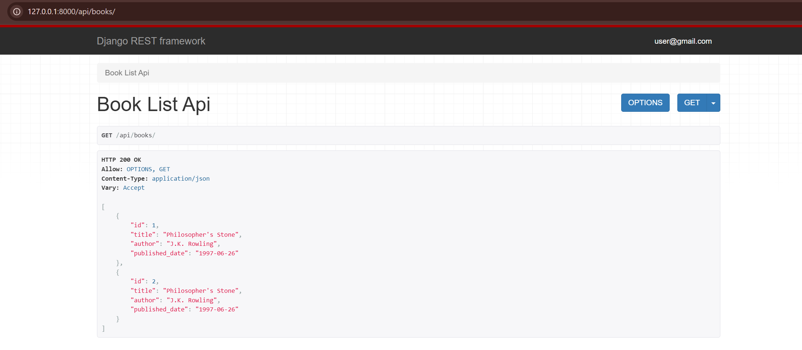

#Django REST Framework (DRF) API

This task involved installing Django REST Framework to create a read-only API for a new `Book` model within the `PythonTasksDjango2` project. A new app, `api`, was created to house this functionality.

##Installation & Setup

First, DRF was installed (`pip install djangorestframework`) and added to `settings.py`. A new app named `api` was also created and registered.

**`PythonTasksDjango2/settings.py`**
```python
INSTALLED_APPS = [
    # ...
    'users',
    'rest_framework',
    'api',              # Added the new API app
]
```

## Model Creation (`api/models.py`)

New `Author` and `Book` models were created in the `api` app.

```python
from django.db import models

class Author(models.Model):
    name = models.CharField(max_length=100)
    def __str__(self):
        return self.name

class Book(models.Model):
    title = models.CharField(max_length=200)
    author = models.ForeignKey(Author, on_delete=models.CASCADE, related_name='books')
    published_date = models.DateField(null=True, blank=True)
    def __str__(self):
        return self.title
```

##Serializer (`api/serializers.py`)

A `serializers.py` file was created to translate the `Book` model into JSON format. `StringRelatedField` is used to show the author's name instead of their ID.

```python
from rest_framework import serializers
from .models import Book, Author

class BookSerializer(serializers.ModelSerializer):
    author = serializers.StringRelatedField()

    class Meta:
        model = Book
        fields = ['id', 'title', 'author', 'published_date']
```

## 4. Views (`api/views.py`)

A function-based view (`book_list_api`) and a class-based view (`BookDetailAPI`) were created to handle the API logic.

```python
from rest_framework.decorators import api_view
from rest_framework.response import Response
from rest_framework.views import APIView
from django.shortcuts import get_object_or_404
from .models import Book
from .serializers import BookSerializer

# Function-based view for list
@api_view(['GET'])
def book_list_api(request):
    if request.method == 'GET':
        books = Book.objects.all()
        serializer = BookSerializer(books, many=True)
        return Response(serializer.data)

# Class-based view for detail
class BookDetailAPI(APIView):
    def get(self, request, pk, format=None):
        book = get_object_or_404(Book, pk=pk)
        serializer = BookSerializer(book)
        return Response(serializer.data)
```

## URL Configuration

Finally, the URLs were configured to route requests to the correct views.

**`PythonTasksDjango2/urls.py` (Main Project)**
```python
from django.contrib import admin
from django.urls import path, include

urlpatterns = [
    path('admin/', admin.site.urls),
    path('', include('users.urls')),
    path('api/', include('api.urls')),  # Added API app URLs
]
```

**`api/urls.py` (API App)**
```python
from django.urls import path
from .views import book_list_api, BookDetailAPI

urlpatterns = [
    path('books/', book_list_api, name='book-list-api'),
    path('books/<int:pk>/', BookDetailAPI.as_view(), name='book-detail-api'),
]
```

## Final Result

The API endpoints are now active and return the book data in JSON format, viewable in DRF's browsable API.


