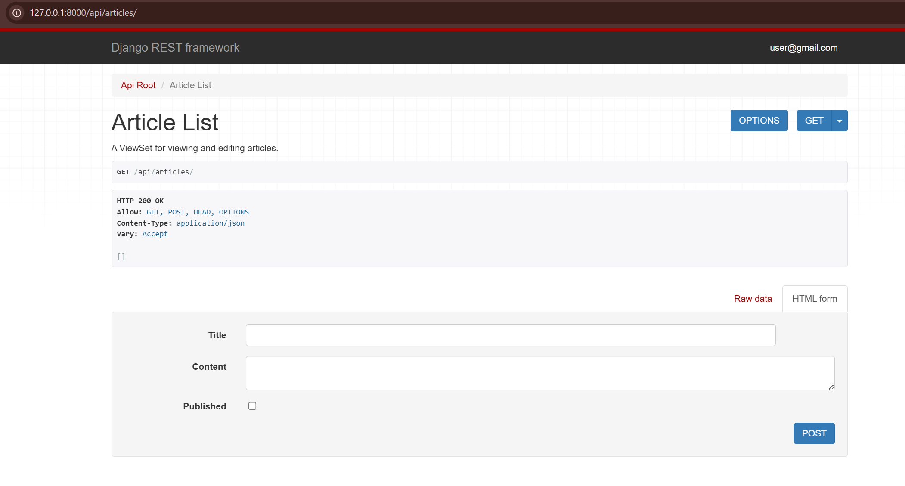
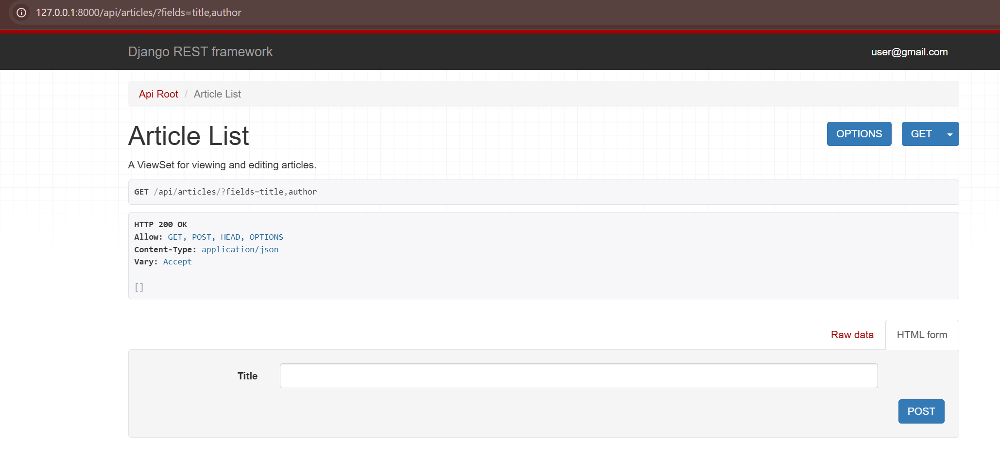
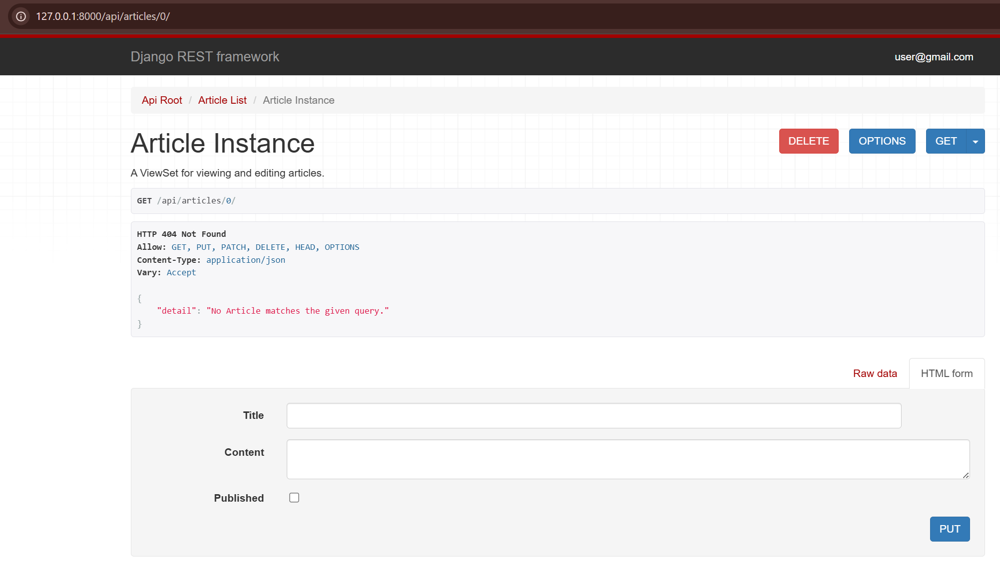
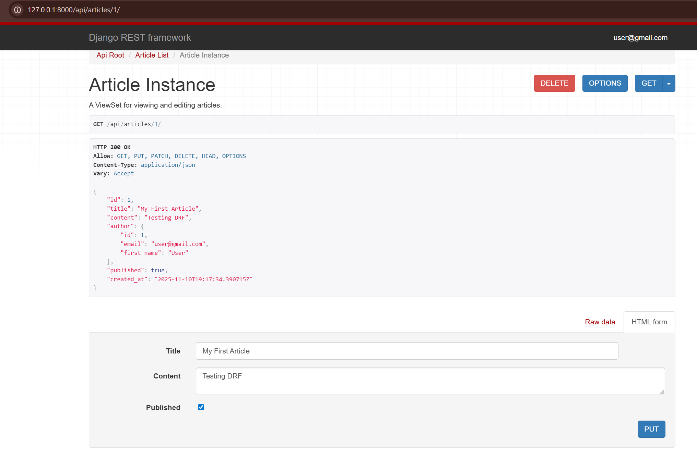

# DRF ViewSets, Routers, & Dynamic Serializers

This task involved implementing a powerful and flexible API for a new `Article` model using DRF's `ViewSet` and `Router` components. A key feature was the implementation of a dynamic `ModelSerializer` that can change the fields it displays based on a query parameter.

## Model Creation (`api/models.py`)

A new `Article` model was added to the `api` app. It is linked to the project's `CustomUser` model via a `ForeignKey`.

```python
from django.db import models
from django.conf import settings

# ... (Author and Book models) ...

class Article(models.Model):
    title = models.CharField(max_length=255)
    content = models.TextField()
    author = models.ForeignKey(
        settings.AUTH_USER_MODEL, 
        on_delete=models.CASCADE
    )
    published = models.BooleanField(default=False)
    created_at = models.DateTimeField(auto_now_add=True)

    def __str__(self):
        return self.title
```

## Dynamic Serializer (`api/serializers.py`)

The `ArticleSerializer` was built to be dynamic. It inspects the `request` context for a `?fields=` query parameter and modifies its output fields accordingly. An `AuthorSerializer` was also added to display nested user data.

```python
from rest_framework import serializers
from .models import Book, Author, Article
from users.models import CustomUser

# ... (BookSerializer) ...

class AuthorSerializer(serializers.ModelSerializer):
    class Meta:
        model = CustomUser
        fields = ['id', 'email', 'first_name']

class ArticleSerializer(serializers.ModelSerializer):
    author = AuthorSerializer(read_only=True)
    
    class Meta:
        model = Article
        fields = ['id', 'title', 'content', 'author', 'published', 'created_at']

    def __init__(self, *args, **kwargs):
        super().__init__(*args, **kwargs)

        request = self.context.get('request')
        if request and request.query_params.get('fields'):
            fields_to_show = request.query_params.get('fields').split(',')
            all_fields = set(self.fields.keys())
            fields_to_remove = all_fields - set(fields_to_show)

            for field_name in fields_to_remove:
                self.fields.pop(field_name)
```

## ViewSet (`api/views.py`)

A single `ArticleViewSet` class was created to handle all CRUD (Create, Retrieve, Update, Delete) operations for the `Article` model. It passes the `request` object to the serializer's context, enabling the dynamic fields functionality.

```python
from rest_framework import viewsets
from rest_framework.decorators import api_view
from rest_framework.response import Response
from rest_framework.views import APIView
from django.shortcuts import get_object_or_404
from .models import Book, Author, Article
from .serializers import BookSerializer, ArticleSerializer

# ... (Book API views) ...

class ArticleViewSet(viewsets.ModelViewSet):
    queryset = Article.objects.all()
    serializer_class = ArticleSerializer

    def get_serializer_context(self):
        context = super().get_serializer_context()
        context.update({"request": self.request})
        return context
```

## 4. Router Configuration (`api/urls.py`)

DRF's `DefaultRouter` was used to automatically generate all the necessary URL patterns for the `ArticleViewSet`, replacing the need to write each `path` manually.

```python
from django.urls import path, include
from rest_framework.routers import DefaultRouter
from .views import book_list_api, BookDetailAPI, ArticleViewSet

router = DefaultRouter()
router.register(r'articles', ArticleViewSet, basename='article')

urlpatterns = [
    path('books/', book_list_api, name='book-list-api'),
    path('books/<int:pk>/', BookDetailAPI.as_view(), name='book-detail-api'),

    path('', include(router.urls)),
]
```

## Final Results







