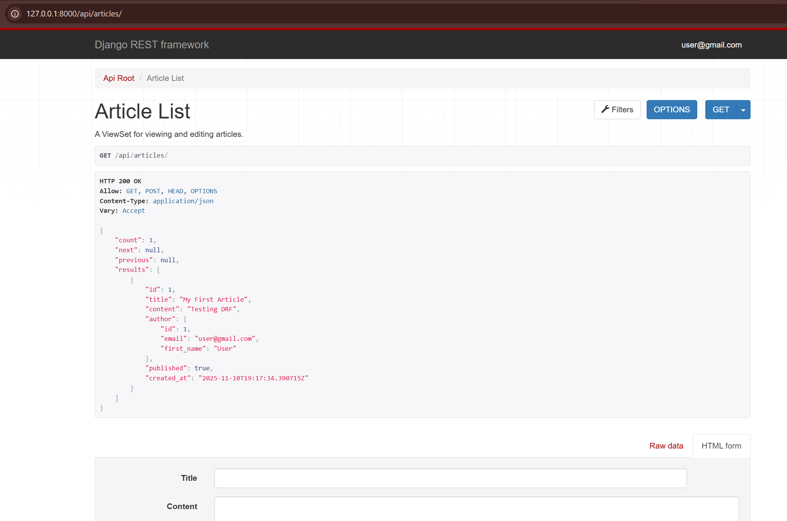
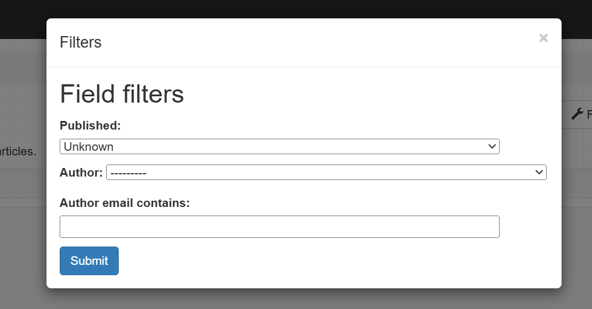

# Pagination, Filtering and Custom Commands

This task involved adding professional-grade features to the `Article` API, including pagination to handle large datasets, filtering to allow for specific queries and a custom management command to interact with the project from the command line.

## API Pagination

Pagination was implemented to limit the number of results returned per page, with navigation links for "next" and "previous".

### `api/pagination.py`

A custom pagination class was created to set the default page size.

```python
from rest_framework.pagination import PageNumberPagination

class StandardArticlePagination(PageNumberPagination):
    page_size = 5
    page_size_query_param = 'page_size'
    max_page_size = 100
```

### `api/views.py`

The `ArticleViewSet` was updated to use this new pagination class.

```python
# ... (other imports) ...
from .pagination import StandardArticlePagination

class ArticleViewSet(viewsets.ModelViewSet):
    queryset = Article.objects.all()
    serializer_class = ArticleSerializer
    pagination_class = StandardArticlePagination # <-- Added this line
    # ... (rest of the class) ...
```

### Result: Paginated Output

The API endpoint `/api/articles/` now returns a paginated structure, as confirmed by the `count`, `next`, `previous`, and `results` keys.



## API Filtering

`django-filter` was installed and configured to allow filtering the `Article` list by its fields.

### `api/filters.py`

A `FilterSet` was created to define which fields can be filtered. This example allows filtering by `published` status and the `author__email` field.

```python
import django_filters
from .models import Article

class ArticleFilter(django_filters.FilterSet):
    author_email = django_filters.CharFilter(
        field_name='author__email', 
        lookup_expr='icontains'
    )

    class Meta:
        model = Article
        fields = ['published', 'author']
```

### `api/views.py`

The `ArticleViewSet` was updated to enable the `DjangoFilterBackend` and use the new `ArticleFilter`.

```python
# ... (other imports) ...
from django_filters.rest_framework import DjangoFilterBackend
from .filters import ArticleFilter

class ArticleViewSet(viewsets.ModelViewSet):
    queryset = Article.objects.all()
    serializer_class = ArticleSerializer
    pagination_class = StandardArticlePagination
    
    filter_backends = [DjangoFilterBackend]
    filterset_class = ArticleFilter
    
    # ... (rest of the class) ...
```

## Custom Management Command

A custom command `count_articles` was created to print the total number of articles in the database.

### `api/management/commands/count_articles.py`

The required directory structure (`api/management/commands/`) was created and the command file was added.

```python
from django.core.management.base import BaseCommand
from api.models import Article

class Command(BaseCommand):
    help = 'Prints the total number of articles in the database'

    def handle(self, *args, **options):
        count = Article.objects.count()
        self.stdout.write(
            self.style.SUCCESS(f'Total Articles: {count}')
        )
```

### Result: Command Line Output

Running the command in the terminal produces the following output:

```bash
(.venv) PS C:\...\... python manage.py count_articles

Total Articles: 1
```


