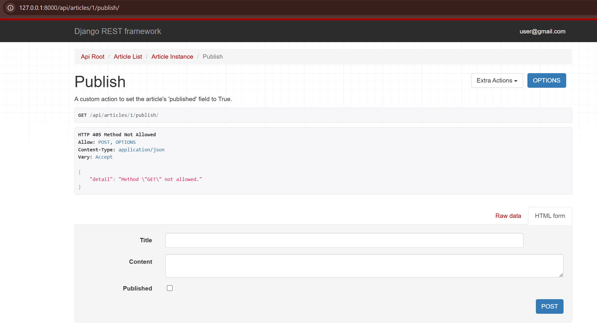

# DRF Permissions and Custom Actions

This task involved adding an extra layer of security to the API using `Custom Permissions` and adding new functionality (`@action`) to the `ArticleViewSet`.

## Create a Custom Permission (`IsAuthor`)

A new `api/permissions.py` file was created to define the `IsAuthor` permission. This permission checks if the current user is the author of the `Article` and only then allows them to `PUT` (update) or `DELETE` it.

### `api/permissions.py`

```python
from rest_framework import permissions

class IsAuthor(permissions.BasePermission):
    def has_object_permission(self, request, view, obj):
        return obj.author == request.user
```

## Apply Permissions to the ViewSet

The `ArticleViewSet` was updated to use the new `IsAuthor` permission along with `IsAuthenticatedOrReadOnly`.

By overriding the `perform_create` method, the author is now automatically set to the currently logged-in user upon article creation.

### `api/views.py` (Updated `ArticleViewSet`)

```python
from rest_framework import viewsets
from rest_framework.decorators import api_view, action
from rest_framework.response import Response
from rest_framework.views import APIView
from django.shortcuts import get_object_or_404

from .models import Book, Author, Article
from .serializers import BookSerializer, ArticleSerializer

from django_filters.rest_framework import DjangoFilterBackend
from .filters import ArticleFilter
from .pagination import StandardArticlePagination

from rest_framework.permissions import IsAuthenticatedOrReadOnly
from .permissions import IsAuthor

# ... (Book API views) ...

class ArticleViewSet(viewsets.ModelViewSet):
    queryset = Article.objects.all()
    serializer_class = ArticleSerializer
    pagination_class = StandardArticlePagination
    filter_backends = [DjangoFilterBackend]
    filterset_class = ArticleFilter
    
    permission_classes = [IsAuthenticatedOrReadOnly, IsAuthor]

    def get_serializer_context(self):
        context = super().get_serializer_context()
        context.update({"request": self.request})
        return context

    def perform_create(self, serializer):
        serializer.save(author=self.request.user)

    @action(detail=True, methods=['POST'])
    def publish(self, request, pk=None):
        article = self.get_object()
        
        if not IsAuthor().has_object_permission(request, self, article):
            return Response(
                {"error": "You are not the author of this article."},
                status=403
            )
        
        article.published = True
        article.save()
        
        serializer = self.get_serializer(article)
        return Response(serializer.data)
```

## Custom Action (`@action`)

A `publish` action was added to the `ArticleViewSet`. This creates a new API endpoint (`/api/articles/ID/publish/`) that, on a `POST` request, will set the article's `published` field to `True`.

*(The `@action` code is included in the `api/views.py` block above).*

## Final Results

The API is now fully secured. Users can read articles, but only authors can edit, delete, or perform the `publish` action on them.

### Testing the `publish` Action

A `GET` request to `/api/articles/1/publish/` correctly returns "Method Not Allowed," as the action is configured to only accept `POST`.


